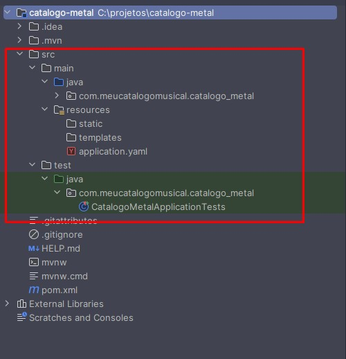
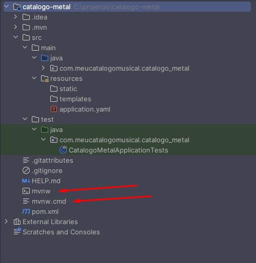

# A Linha de Montagem: Dominando o Maven e o pom.xml no Spring Boot

Imagine uma fábrica de montagem de carros. Você não constrói um veículo derretendo metal para forjar os próprios parafusos, nem sai correndo pela fábrica procurando onde estão os pneus. Você tem uma **planta (o projeto de engenharia)** que diz exatamente quais peças pré-fabricadas são necessárias e uma **linha de montagem automatizada** que sabe a ordem exata das coisas: por exemplo, primeiro o chassi, depois o motor, depois a lataria e, por fim, os testes de segurança.

No desenvolvimento de software Java moderno, o **Maven** é a nossa linha de montagem automatizada, e o arquivo **pom.xml** é a nossa planta de engenharia. Eles garantem que, não importa quem aperte o botão de iniciar, o "carro" (sua aplicação) sairá sempre igual, usando as peças (bibliotecas) corretas.

## O Caos Antes da Ordem: O Contexto Real

Se você conversasse com um desenvolvedor Java no início dos anos 2000, ouviria histórias de terror sobre o "JAR Hell" (O Inferno dos JARs). Para usar uma biblioteca externa, era preciso ir ao site do criador, baixar um arquivo `.jar` manualmente, colocá-lo em uma pasta chamada `lib` e rezar para que as versões não entrassem em conflito.

Em sistemas reais e arquiteturas de microsserviços modernas, onde empresas como Netflix ou Amazon gerenciam centenas de aplicações simultâneas, o processo manual é inviável. Precisamos de reprodutibilidade absoluta. O Maven resolve esse problema automatizando o download das dependências corretas, gerenciando versões e padronizando como o código é compilado, testado e empacotado para ir à produção via esteiras de CI/CD (Integração e Entrega Contínuas).

> De acordo com a documentação oficial da Apache Software Foundation, criadora da ferramenta: *"O Apache Maven é uma ferramenta de compreensão e gerenciamento de projetos de software. Baseado no conceito de um Project Object Model (POM), o Maven pode gerenciar a construção (build), os relatórios e a documentação de um projeto a partir de uma informação central."* Em suma, ele aplica padrões estritos para que o ciclo de vida do software seja previsível.

## A Padronização: Pastas e o Maven Wrapper

Quando criamos um projeto no Spring Initializr, como o `catalogo-metal`, notamos que o projeto já nasce com uma estrutura de diretórios muito específica. O Maven impõe essa padronização por um motivo simples: **convenções** e **familiaridade**. Se você for contratado hoje por um banco na Europa ou por uma startup no Brasil, a estrutura base do projeto Java será idêntica:

  * `src/main/java`: Onde mora o código-fonte principal da sua aplicação (ex: seus *Controllers* e *Services*).
  * `src/main/resources`: Onde ficam os arquivos de configuração (como `application.properties` ou `application.yaml`), certificados ou scripts de banco de dados. As pastas como `templates` ou `static` são para aplicações web com telas acopladas, para APIs REST essas pastas não são utilizadas.
  * `src/test/java`: Onde residem as classes de testes automatizados. O Maven separa estritamente o código de produção do código de teste.



Na raiz do projeto, além do `pom.xml`, encontramos dois arquivos fantásticos: `mvnw` (para Linux/Mac) e `mvnw.cmd` (para Windows). 



Eles são os **Maven Wrappers**.
A grande sacada de arquitetura do Wrapper é que **você não precisa instalar o Maven no seu sistema operacional**. Se um novo desenvolvedor entra no time hoje, ele só precisa clonar o repositório e rodar o Wrapper. O próprio script entra na internet, baixa a versão exata do Maven que o projeto exige (isolando o ambiente) e executa o *build* "por debaixo dos panos". As IDEs modernas, como IntelliJ e Eclipse (STS), também já possuem o Maven embutido, facilitando o desenvolvimento visual.

## O Coração do Projeto: Entendendo o pom.xml de um projeto Spring Boot

O `pom.xml` (Project Object Model) é o cérebro da operação. Ele é um arquivo XML (portanto, deve seguir regras estritas de abertura e fechamento de *tags*) que dita o que o projeto é e do que ele precisa.

Vamos dissecar o POM gerado para a nossa API do `meucatalogomusical.com`:

```xml
<?xml version="1.0" encoding="UTF-8"?>
<project xmlns="http://maven.apache.org/POM/4.0.0" xmlns:xsi="http://www.w3.org/2001/XMLSchema-instance"
	xsi:schemaLocation="http://maven.apache.org/POM/4.0.0 https://maven.apache.org/xsd/maven-4.0.0.xsd">
	<modelVersion>4.0.0</modelVersion>
    
	<parent>
		<groupId>org.springframework.boot</groupId>
		<artifactId>spring-boot-starter-parent</artifactId>
		<version>3.5.13</version>
		<relativePath/> 
	</parent>
```

  * **A Tag `<parent>`:** Aqui acontece uma das maiores mágicas do ecossistema Spring Boot. Como desenvolvedores experientes, sabemos que gerenciar versões de centenas de bibliotecas gera conflitos. Ao declarar o `spring-boot-starter-parent` como "pai" do nosso projeto, estamos herdando uma árvore gigantesca de configurações pré-testadas. É o pai que diz: *"Se você for usar o banco de dados X e a biblioteca de segurança Y, eu já sei quais versões funcionam perfeitamente juntas na versão 3.5.13"*.

```xml
	<groupId>com.meucatalogomusical</groupId>
	<artifactId>catalogo-metal</artifactId>
	<version>0.0.1-SNAPSHOT</version>
	<properties>
		<java.version>25</java.version>
	</properties>
```

  * **Identidade e Properties:** `groupId` (a empresa/domínio), `artifactId` (o nome do software) e a `version` formam as coordenadas únicas do seu artefato no mundo (GAV - Group, Artifact, Version). Na tag `<properties>`, definimos configurações customizadas. Lembra do `<parent>`? O Spring Boot 3.5.13 usa Java 17 por padrão. Ao declarar `<java.version>25</java.version>`, nós **sobrescrevemos** a configuração do pai, forçando o uso da versão LTS mais recente do Java.

<!-- end list -->

```xml
	<dependencies>
		<dependency>
			<groupId>org.springframework.boot</groupId>
			<artifactId>spring-boot-starter-web</artifactId>
		</dependency>
		<dependency>
			<groupId>org.springframework.boot</groupId>
			<artifactId>spring-boot-starter-test</artifactId>
			<scope>test</scope>
		</dependency>
	</dependencies>
```

  * **As `<dependencies>`:** Aqui listamos as peças da linha de montagem. Note que os `starters` do Spring Boot agrupam várias ferramentas. O `starter-web` traz o servidor Tomcat, os conversores de JSON, os validadores HTTP, tudo de uma vez. A dependência de teste possui a instrução `<scope>test</scope>`, o que significa que o Maven é inteligente o suficiente para não empacotar ferramentas de teste no arquivo final que vai para o cliente, economizando memória.

<!-- end list -->

```xml
	<build>
		<plugins>
			<plugin>
				<groupId>org.springframework.boot</groupId>
				<artifactId>spring-boot-maven-plugin</artifactId>
			</plugin>
		</plugins>
	</build>
</project>
```

  * **O `<build>` e os `<plugins>`:** Se as dependências são as peças do carro, os **Plugins são as máquinas robóticas que montam o carro**. O Maven, por si só, é apenas uma casca vazia. Quem faz o trabalho sujo de compilar o código Java, rodar os testes e compactar o arquivo são os plugins. O `spring-boot-maven-plugin` é a "máquina" que pega a nossa aplicação comum e a transforma em um *Fat JAR* executável (que contém o servidor embutido).
    O POM oferece extrema flexibilidade. Você pode criar builds personalizados, adicionando plugins para verificar a qualidade do código (como o SonarQube) ou para gerar relatórios de cobertura de testes diretamente via XML.

## A Árvore de Dependências e o Repositório Local (.m2)

Mas e se o Dream Theater dependesse do Rush para existir, e o Rush dependesse do Black Sabbath? Na engenharia de software, chamamos isso de **Dependências Transitivas**.

Quando você pede o `spring-boot-starter-web`, ele precisa do Tomcat, que por sua vez precisa de outras bibliotecas menores. O Maven faz o "Dependency Resolve" (Resolução de Dependências) automaticamente, calculando essa árvore inteira.

Para ver essa teia complexa, você pode abrir o terminal na raiz do projeto e digitar:

  * `./mvnw dependency:tree` (Mostra visualmente a árvore de quem chamou quem).
  * `./mvnw dependency:resolve` (Lista tudo que foi baixado).

**Onde esses arquivos ficam?** O Maven é inteligente. Ele não baixa a mesma biblioteca duas vezes na sua máquina. Ele cria uma pasta oculta chamada `.m2` no diretório do seu usuário (ex: `C:\Users\Jean\.m2\repository`). Todos os projetos da sua máquina consultam esse "armazém central" local antes de tentar baixar da internet, economizando banda e tempo.

## Colocando a Fábrica para Funcionar: Os Comandos do Build

"Fazer o *build*" significa executar o ciclo de vida de montagem do software. Fora da IDE, no terminal de linha de comando, nós conversamos com o Maven (ou seu Wrapper) através de ordens claras.

Os principais comandos que todo engenheiro de software usa no dia a dia são:

  * `./mvnw clean`: A faxina. Ele apaga a pasta `target` (onde ficam os arquivos gerados do build anterior). Garante que você não suba código velho ou em cache para produção.
  * `./mvnw compile`: Traduz o código humano (`.java`) para a linguagem da máquina virtual (`.class`).
  * `./mvnw test`: Executa os testes automatizados da aplicação. Se algum teste falhar, o Maven aborta o processo de montagem.
  * `./mvnw package`: Pega o código compilado e empacota tudo em um arquivo distribuível (como o nosso querido `.jar`).
  * `./mvnw install`: Pega o `.jar` gerado e copia para o seu armazém local (a pasta `.m2`), para que outros projetos na sua máquina possam consumi-lo.

O verdadeiro poder do Maven é o encadeamento. Em esteiras corporativas, o comando mais famoso do mundo é:
`./mvnw clean package`
Ele limpa a sujeira anterior, compila o código novo, roda todos os testes e, se tudo der sucesso, gera o pacote executável dentro da pasta `target`.

### Mentalidade de Experiência: Erros Comuns no Dia a Dia

**A Batalha pela Porta 8080 (Address already in use):**
Um rito de passagem para todo desenvolvedor. Você clicou no botão "Play" verde no IntelliJ e a aplicação do Catálogo Musical subiu usando a porta 8080. Depois, você abre o terminal e tenta rodar o projeto compilado usando `java -jar target/catalogo-metal-0.0.1-SNAPSHOT.jar`. O terminal explode com um erro assustador. O que aconteceu? Duas aplicações não podem ocupar a mesma porta de rede no sistema operacional simultaneamente. Para resolver, basta parar a execução na IDE antes de testar o pacote no terminal.

## Decisão de Engenharia: Quando usar Maven e Alternativas

  * **Quando usar o Maven:** É o padrão absoluto para a vasta maioria dos projetos corporativos Java e Spring. Se você quer estabilidade, um ecossistema gigantesco de documentação e familiaridade universal entre as equipes, o Maven é a escolha primária.
  * **Alternativas (O Gradle):** A principal alternativa de mercado ao Maven é o **Gradle**. Ele não usa o formato verboso XML, mas sim DSLs baseadas em Groovy ou Kotlin (o que permite escrever lógicas de programação complexas no próprio arquivo de configuração). O Gradle é absurdamente mais rápido que o Maven em projetos monstruosos (monólitos com milhões de linhas) devido ao seu avançado sistema de cache em disco. Quando usar? A plataforma Android abandonou o Maven e usa Gradle como padrão. Grandes arquiteturas de microsserviços muito complexas também costumam migrar para ele.
  * **Trade-off (XML vs DSL):** O XML do Maven é engessado e longo, mas extremamente previsível e legível por ferramentas visuais. O código do Gradle é curto e programável, mas pode gerar uma curva de aprendizado maior e configurações caóticas se não houver disciplina na equipe.

## Conclusão

Entender o Maven e o `pom.xml` é entender como o código sai da sua máquina e vira um produto real e distribuível. Ao dominar a hierarquia do POM, a injeção de dependências e os comandos de terminal, você para de depender de "botões mágicos" de IDEs e entende a real engenharia de infraestrutura da sua aplicação. Essa previsibilidade rigorosa é o que permite escalabilidade extrema em servidores remotos, garantindo que o software do seu catálogo de Metal tocará com o mesmo peso, seja no seu *notebook* local ou em um contêiner nos servidores da Amazon.

-----

**Referências e Recomendações de Leitura Complementar:**

  * Documentação Oficial do Apache Maven: [https://maven.apache.org/what-is-maven.html](https://www.google.com/search?q=https://maven.apache.org/what-is-maven.html)
  * Documentação do Spring Boot Maven Plugin: [https://docs.spring.io/spring-boot/docs/current/maven-plugin/reference/htmlsingle/](https://www.google.com/search?q=https://docs.spring.io/spring-boot/docs/current/maven-plugin/reference/htmlsingle/)

**Veja também as fundações arquiteturais que guiam nossos serviços:**

  * [O Idioma da Web: Desmistificando o Protocolo HTTP](https://www.google.com/search?q=../../http)
  * [Do Zero à Produção: A Engenharia por Trás do Spring Initializr](https://www.google.com/search?q=../../spring-initializr)