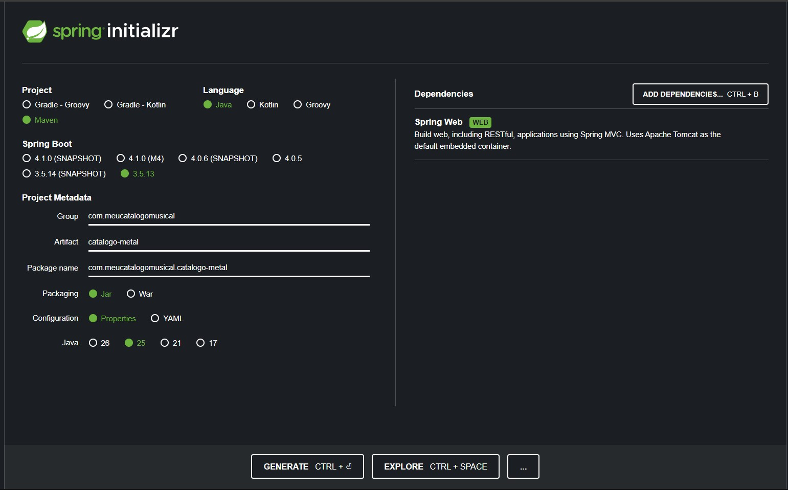
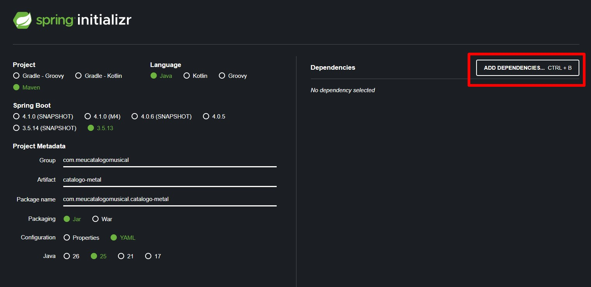
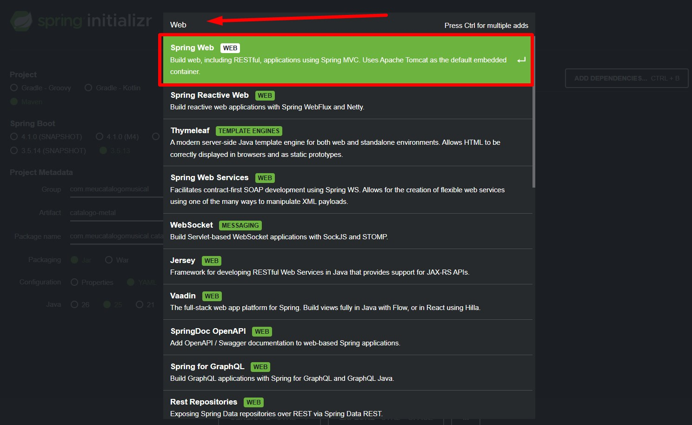
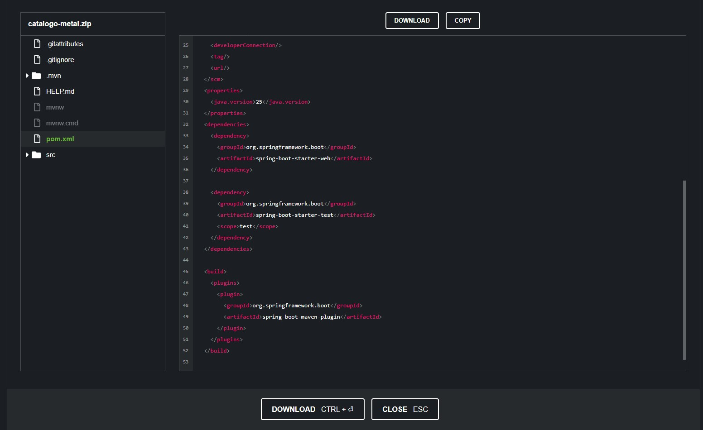
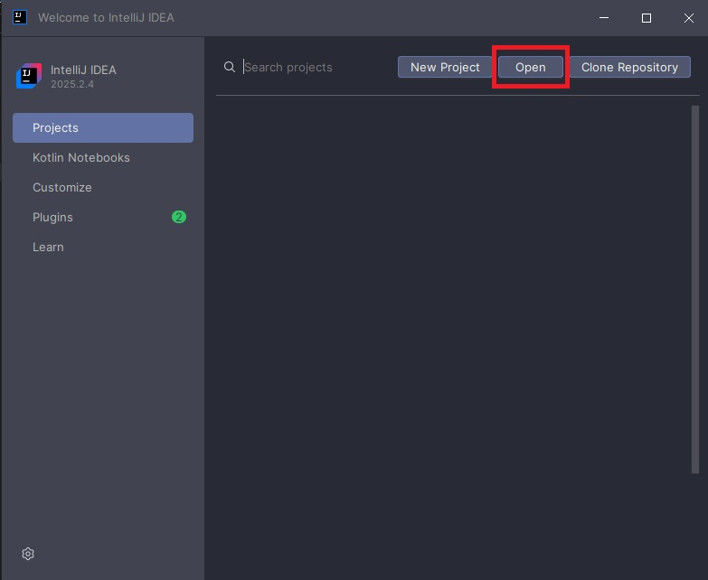
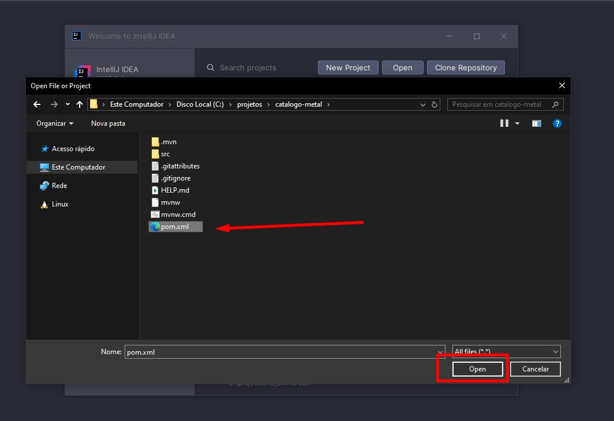
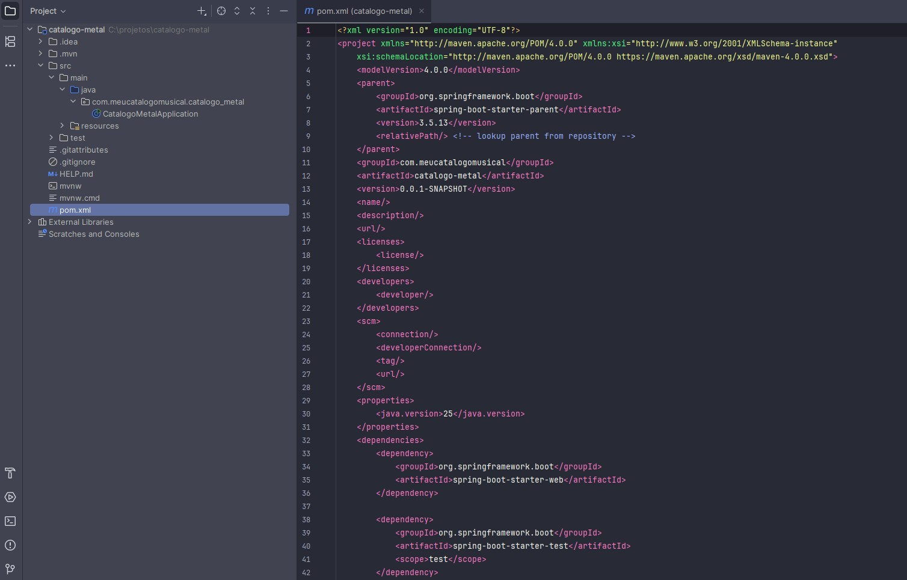

# Do Zero à Produção: A Engenharia por Trás do Spring Initializr

Imagine que você decidiu cozinhar um prato complexo para um jantar especial. Você tem duas opções: ir ao supermercado, procurar cada ingrediente em corredores diferentes, pesar farinha, tentar descobrir qual marca de molho combina com a massa escolhida e correr o risco de esquecer algo crucial; ou você pode assinar um serviço de "Kits de Receitas" (como o The Market | O Mercado de Receitas). Você diz "Quero fazer um risoto", e uma caixa chega à sua porta com o arroz exato, os temperos na medida certa e o passo a passo. Você ainda precisa ir para o fogão, aplicar sua técnica e cozinhar, mas algumas partesjá foram resolvidas.

No desenvolvimento de software corporativo, o **Spring Initializr** é o nosso kit de receitas. Ele não vai escrever as regras de negócio do seu sistema, mas entrega a estrutura fundamental perfeita, com todas as dependências pré-testadas e compatíveis, para que você comece a "cozinhar" o seu código imediatamente.

## O Contexto Real: Por que não começamos do zero?

Em sistemas reais — seja em uma startup ágil ou em gigantes de tecnologia —, o tempo até o mercado (*time-to-market*) é crucial. No passado, iniciar um projeto Java exigia criar manualmente a árvore de diretórios (`src/main/java`), configurar arquivos XML complexos e caçar versões de bibliotecas na internet torcendo para que não houvesse conflito entre elas.

Hoje, em uma arquitetura de microsserviços, por exemplo, onde uma equipe pode precisar criar um novo serviço de mensageria ou um novo catálogo de produtos em questão de horas, não há espaço para trabalho braçal repetitivo. O Initializr resolve o problema do "ponto de partida", padronizando a fundação de milhares de aplicações ao redor do mundo.

> De acordo com a documentação oficial da VMware, o Spring Initializr é primariamente "*uma API web extensível que gera projetos rápidos baseados na JVM. Ele inspeciona a meta-dados do projeto solicitados e gera um projeto com a infraestrutura e dependências apropriadas*". Criado originalmente por Josh Long e Stéphane Nicoll, ele se tornou a espinha dorsal da adoção em massa do Spring Boot.

## Dissecando o Spring Initializr

Para acessar o Spring Initializr acesse [start.spring.io](https://start.spring.io/).



### 1\. Project (Ferramenta de Build)

Temos as opções Gradle (Groovy/Kotlin) e Maven. Para o nosso exemplo, escolheremos o **Maven**. Ele é o padrão de mercado mais antigo e amplamente adotado no ecossistema Java. A ferramenta de build será responsável por baixar nossas bibliotecas, compilar o código, rodar os testes e empacotar a aplicação.

### 2\. Language

Escolheremos **Java**. O Spring suporta nativamente Kotlin e Groovy, mas o Java continua sendo a linguagem franca do backend corporativo.

### 3\. Spring Boot Version

Aqui separamos os amadores dos profissionais. Você verá versões com sufixos diferentes:

  * **SNAPSHOT:** É a versão de desenvolvimento, que está sendo alterada neste exato segundo pelos engenheiros do Spring. É altamente instável. Nunca use em produção.
  * **M (Milestone, ex: M4):** É um marco de entrega. A equipe fechou um pacote de funcionalidades para a comunidade testar, mas ainda pode ter bugs críticos.
  * **Sem sufixo (ex: 3.5.13):** Esta é a versão **GA (General Availability)**. É a versão estável, testada à exaustão e pronta para produção. As versões estáveis são as melhores escolhas para projetos reais.

### 4\. Project Metadata (A Identidade do seu Serviço)

  * **Group:** Geralmente é o domínio da sua empresa invertido. Usaremos `com.meucatalogomusical`. Isso evita conflitos de nomes se publicarmos nosso código mundialmente.
  * **Artifact:** O nome do projeto gerado. Usaremos `catalogo-metal`.
  * **Package Name:** Gerado automaticamente (`com.meucatalogomusical.catalogometal`).
  * **Packaging:** Oferece JAR e WAR. Escolha **JAR**. Antigamente, usávamos arquivos `.war` para implantar a aplicação dentro de um servidor externo pesadíssimo. Na era moderna dos microsserviços, o Spring Boot já embute o servidor (Tomcat) dentro de um arquivo `.jar` executável, permitindo que a aplicação rode de forma independente.
  * **Configuration:** Oferece Properties ou YAML. É uma escolha estilística de como você organizará as variáveis de ambiente.
  * **Java Version:** Selecionaremos a **25**. Sempre priorize versões LTS (*Long Term Support*), pois elas garantem atualizações de segurança por anos.

### 5\. Dependencies



Aqui escolhemos as peças do nosso quebra-cabeça. Bas ta digitar ou procurar pela dependência desejada. Para disponibilizar nossa aplicação na web e responder requisições HTTP, adicionaremos apenas o **Spring Web** para exemplificar.



Antes de clicar em *Generate* (que fará o download de um arquivo `.zip`), existe um botão mágico chamado **EXPLORE**. Ele permite que você visualize a estrutura completa do código e o arquivo `pom.xml` diretamente no navegador, sem precisar baixar nada. É uma ferramenta fantástica de *code review* rápido.



## O Código Gerado e a Prática

Após clicar em *Generate* e baixar o projeto, descompactar e abra o projeto na sua IDE (como o IntelliJ IDEA), você verá uma estrutura limpa e profissional.

Para isso basta clicar em *Open*


Ir até o local onde salvou o projeto e selecionar o arquivo `pom.xml` e clicar em *Open*


Logo após clicar em *Open* basta clicar em *Open as Project*

Após carregar o projeto, no lado esquerdo podemos ver a árvore de diretórios. No lado direito, abrimos o arquivo pom.xml.



O coração do que o Initializr gerou é o arquivo `pom.xml`. Graças a ele, se precisarmos do catálogo das lendas do Metal, a fundação está pronta para receber a nossa classe controladora:

```java
package com.meucatalogomusical.catalogometal.controllers;

import org.springframework.web.bind.annotation.GetMapping;
import org.springframework.web.bind.annotation.RequestMapping;
import org.springframework.web.bind.annotation.RestController;
import java.util.List;
import java.util.Arrays;

@RestController
@RequestMapping("/api/v1/bandas-metal")
public class MetalController {

    @GetMapping
    public List<String> obterLineupDePeso() {
        // Exemplo técnico: Retornando um payload JSON graças à configuração do Spring Web
        return Arrays.asList(
            "Dream Theater", 
            "Opeth", 
            "Gojira", 
            "Black Sabbath", 
            "Angra"
        );
    }
}
```

## Visão de Arquitetura: A Abordagem de Gigantes

Em grandes corporações de TI, permitir que qualquer desenvolvedor acesse o `start.spring.io` público é um risco de arquitetura. O que essas empresas fazem é pegar o código fonte do Spring Initializr (que é aberto) e hospedar uma **versão interna e customizada**. Assim, quando um time vai criar um novo microsserviço, o Initializr da empresa já injeta automaticamente bibliotecas de segurança corporativa, rastreamento distribuído (telemetria) e padrões de log específicos daquela organização, garantindo que o serviço nasça 100% em conformidade com as regras da empresa.

## Decisões de Engenharia (Trade-offs)

  * **Quando usar:** Para iniciar 99% dos microsserviços modernos, APIs REST, ou aplicações web padrão onde a velocidade de *setup* é essencial.
  * **Quando NÃO usar:** Se a sua empresa possui um ecossistema extremamente acoplado e legados com servidores de aplicação pesados (como WebSphere ou JBoss antigos) que exigem estruturas `.war` altamente customizadas fora do padrão do Spring Boot.
  * **Alternativas:** Você pode clonar um repositório modelo no GitHub (*Template Repositories*) ou usar os tradicionais *Archetypes* do Maven por linha de comando.

### Erros Comuns de Desenvolvedores

1.  **A Síndrome do Acumulador:** Adicionar 15 dependências no Initializr "só por precaução", como bancos de dados, mensageria e segurança, antes mesmo de precisar. Isso aumenta o tamanho do artefato compilado, o tempo de inicialização e a superfície de ataque para falhas de segurança.
2.  **Ignorar os Metadados:** Deixar o Group padrão (`com.example`) ou nomes genéricos no artefato. Quando o microsserviço for para a nuvem e os logs se misturarem, será impossível rastrear a origem do projeto.

## Conclusão

O Spring Initializr é uma prova de que a maturidade de um ecossistema de software não está apenas nos padrões de projeto de código, mas também na ergonomia de como o desenvolvedor inicia seu trabalho. Ele faz um excelente *trade-off*: troca o controle absoluto (e maçante) da configuração inicial manual pela velocidade, previsibilidade e integração garantida. Compreender os metadados gerados, as versões LTS e o empacotamento JAR significa que você parou de preencher formulários no automático e começou a desenhar aplicações prontas para a nuvem.